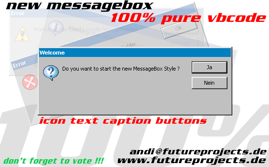



## SEE IT \!\!\! MESSAGEBOX 2\.0 \!\!\! YOU WON'T BELIEVE \!\!\!

### Description

This is the new MessageBox 2.0 !!! Fully customable !!! Easy to implemented !!! Use instead of MsgBox : MessageBox . Same Paramteres!!! and don't forget to vote !!!

Now you can make your own MessageBox: Change the Icon and the buttons and you see you have your own MessageBox.
 
### More Info
 

             |
---                |---
**Submitted On**   |2000-06-03 12:13:56
**By**             |[Andreas Schwarz](https://github.com/Planet-Source-Code/PSCIndex/blob/master/ByAuthor/andreas-schwarz.md)
**Level**          |Beginner
**User Rating**    |2.8 (53 globes from 19 users)
**Compatibility**  |VB 5\.0, VB 6\.0
**Category**       |[Custom Controls/ Forms/  Menus](https://github.com/Planet-Source-Code/PSCIndex/blob/master/ByCategory/custom-controls-forms-menus__1-4.md)
**World**          |[Visual Basic](https://github.com/Planet-Source-Code/PSCIndex/blob/master/ByWorld/visual-basic.md)
**Archive File**   |[CODE\_UPLOAD6383632000\.zip](https://github.com/Planet-Source-Code/andreas-schwarz-see-it-messagebox-2-0-you-won-t-believe__1-8596/archive/master.zip)

